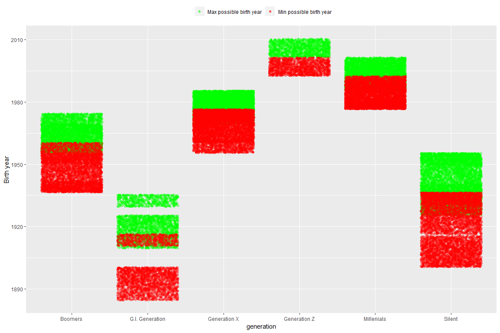
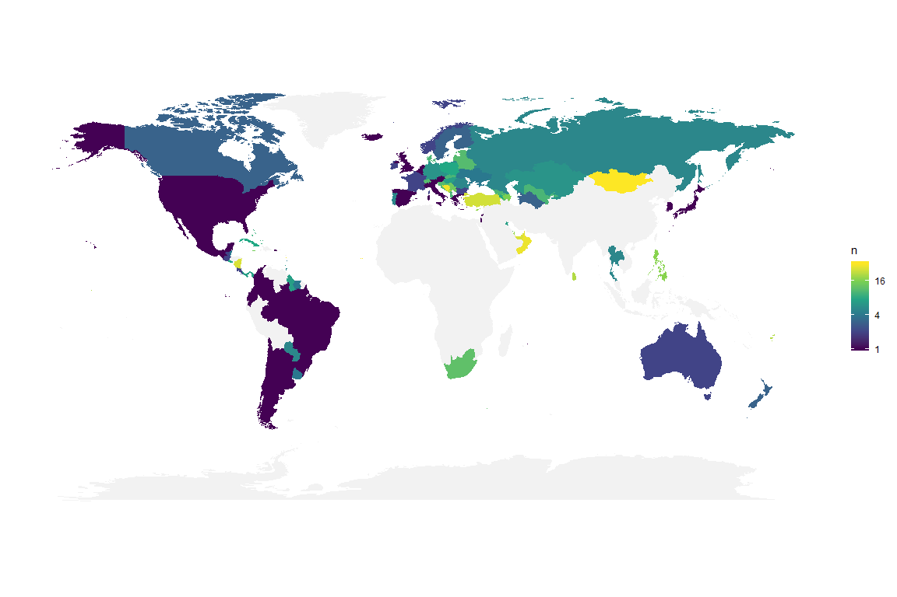
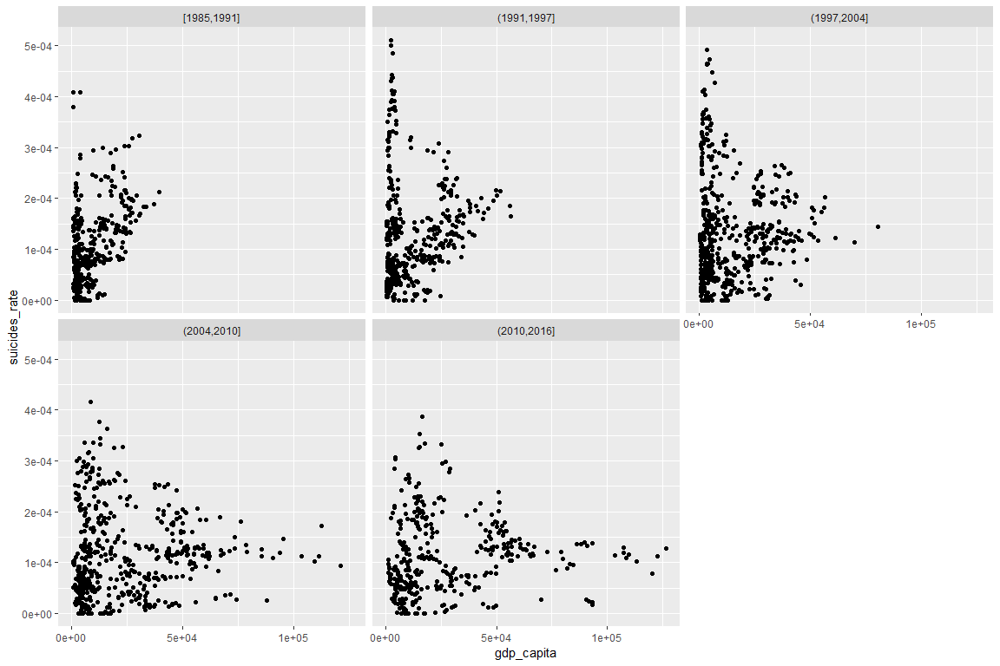

Load library ——————
===================

    library(tidyverse)
    library(skimr)

Load data ——————
================

    data <- read_csv("./data/master.csv")

    ## Parsed with column specification:
    ## cols(
    ##   country = col_character(),
    ##   year = col_double(),
    ##   sex = col_character(),
    ##   age = col_character(),
    ##   suicides_no = col_double(),
    ##   population = col_double(),
    ##   `suicides/100k pop` = col_double(),
    ##   `country-year` = col_character(),
    ##   `HDI for year` = col_double(),
    ##   `gdp_for_year ($)` = col_number(),
    ##   `gdp_per_capita ($)` = col_double(),
    ##   generation = col_character()
    ## )

    data <- data %>% rename(HDI = `HDI for year`,
                            suicides_rate = `suicides/100k pop`,
                            gdp_yearly = `gdp_for_year ($)`,
                            gdp_capita = `gdp_per_capita ($)`)

Data Exploratory ———————–
=========================

Have a look
-----------

    summary(data)

    ##    country               year          sex                age           
    ##  Length:27820       Min.   :1985   Length:27820       Length:27820      
    ##  Class :character   1st Qu.:1995   Class :character   Class :character  
    ##  Mode  :character   Median :2002   Mode  :character   Mode  :character  
    ##                     Mean   :2001                                        
    ##                     3rd Qu.:2008                                        
    ##                     Max.   :2016                                        
    ##                                                                         
    ##   suicides_no        population       suicides_rate    country-year      
    ##  Min.   :    0.0   Min.   :     278   Min.   :  0.00   Length:27820      
    ##  1st Qu.:    3.0   1st Qu.:   97498   1st Qu.:  0.92   Class :character  
    ##  Median :   25.0   Median :  430150   Median :  5.99   Mode  :character  
    ##  Mean   :  242.6   Mean   : 1844794   Mean   : 12.82                     
    ##  3rd Qu.:  131.0   3rd Qu.: 1486143   3rd Qu.: 16.62                     
    ##  Max.   :22338.0   Max.   :43805214   Max.   :224.97                     
    ##                                                                          
    ##       HDI          gdp_yearly          gdp_capita      generation       
    ##  Min.   :0.483   Min.   :4.692e+07   Min.   :   251   Length:27820      
    ##  1st Qu.:0.713   1st Qu.:8.985e+09   1st Qu.:  3447   Class :character  
    ##  Median :0.779   Median :4.811e+10   Median :  9372   Mode  :character  
    ##  Mean   :0.777   Mean   :4.456e+11   Mean   : 16866                     
    ##  3rd Qu.:0.855   3rd Qu.:2.602e+11   3rd Qu.: 24874                     
    ##  Max.   :0.944   Max.   :1.812e+13   Max.   :126352                     
    ##  NA's   :19456

-   country-year column is just a concatenation of country and year
    column

-   suicides/100k pop is calculated by suicides / population \* 100000

-   HDI is Human Development Report, seems missing alot, the only
    variable is missing

-   Age is divided into brackets

A closer look:
--------------

    skim_with(numeric = list(hist = NULL))
    skim(data) %>% skimr::kable()

    ## Skim summary statistics  
    ##  n obs: 27820    
    ##  n variables: 12    
    ## 
    ## Variable type: character
    ## 
    ##    variable      missing    complete      n      min    max    empty    n_unique 
    ## --------------  ---------  ----------  -------  -----  -----  -------  ----------
    ##      age            0        27820      27820     9     11       0         6     
    ##    country          0        27820      27820     4     28       0        101    
    ##  country-year       0        27820      27820     8     32       0        2321   
    ##   generation        0        27820      27820     6     15       0         6     
    ##      sex            0        27820      27820     4      6       0         2     
    ## 
    ## Variable type: numeric
    ## 
    ##    variable       missing    complete      n         mean           sd          p0         p25        p50         p75         p100   
    ## ---------------  ---------  ----------  -------  ------------  ------------  ---------  ---------  ---------  ------------  ---------
    ##   gdp_capita         0        27820      27820     16866.46      18887.58       251       3447       9372        24874       126352  
    ##   gdp_yearly         0        27820      27820     4.5e+11       1.5e+12      4.7e+07     9e+09     4.8e+10     2.6e+11      1.8e+13 
    ##       HDI          19456       8364      27820       0.78         0.093        0.48       0.71       0.78         0.85        0.94   
    ##   population         0        27820      27820    1844793.62    3911779.44      278      97498.5    430150     1486143.25    4.4e+07 
    ##   suicides_no        0        27820      27820      242.57        902.05         0          3         25          131         22338  
    ##  suicides_rate       0        27820      27820      12.82         18.96          0        0.92       5.99        16.62       224.97  
    ##      year            0        27820      27820     2001.26         8.47        1985       1995       2002         2008        2016

There are:

-   6 Age brackets

-   101 differenet countries in this data set

-   Year from 1985 to 2016. (32 years)

-   2321 combinations of country-year (less than 32 \* 101). Must be
    some implicit missing data with year and country

-   6 different generations

-   2 Sex

Extract country stats
---------------------

HDI, GDP per year and per capital are values based on country so it
makes sense to extract those values into another dataframe

    countrystat <- data %>% select(country, year, gdp_yearly, gdp_capita, HDI) %>% 
      distinct()

    data <- data %>% select(-gdp_yearly, -gdp_capita, -HDI, -`country-year`)

Review implicit missing data
----------------------------

    data <- data %>% complete(country, year, sex, age)

Each country year can miss possibly miss all data (6 age group \* 2 sex
= 12) or not missing anydata. Let’s filter any data that is not match
above assumption

    data %>% group_by(country, year) %>% 
      summarise(miss = sum(is.na(suicides_no))) %>% 
      filter(!miss %in% c(0,12))

    ## # A tibble: 16 x 3
    ## # Groups:   country [16]
    ##    country         year  miss
    ##    <chr>          <dbl> <int>
    ##  1 Armenia         2016     2
    ##  2 Austria         2016     2
    ##  3 Croatia         2016     2
    ##  4 Cyprus          2016     2
    ##  5 Czech Republic  2016     2
    ##  6 Grenada         2016     2
    ##  7 Hungary         2016     2
    ##  8 Iceland         2016     2
    ##  9 Lithuania       2016     2
    ## 10 Mauritius       2016     2
    ## 11 Mongolia        2016     2
    ## 12 Netherlands     2016     2
    ## 13 Qatar           2016     2
    ## 14 Romania         2016     2
    ## 15 Sweden          2016     2
    ## 16 Thailand        2016     2

Closer look:

    data %>% filter(year == 2016) %>% right_join(data %>% group_by(country, year) %>% 
      summarise(miss = sum(is.na(suicides_no))) %>% 
      filter(!miss %in% c(0,12)), by = c("country", "year")) %>% 
      filter(is.na(suicides_no))

    ## # A tibble: 32 x 9
    ##    country  year sex   age   suicides_no population suicides_rate
    ##    <chr>   <dbl> <chr> <chr>       <dbl>      <dbl>         <dbl>
    ##  1 Armenia  2016 fema~ 5-14~          NA         NA            NA
    ##  2 Armenia  2016 male  5-14~          NA         NA            NA
    ##  3 Austria  2016 fema~ 5-14~          NA         NA            NA
    ##  4 Austria  2016 male  5-14~          NA         NA            NA
    ##  5 Croatia  2016 fema~ 5-14~          NA         NA            NA
    ##  6 Croatia  2016 male  5-14~          NA         NA            NA
    ##  7 Cyprus   2016 fema~ 5-14~          NA         NA            NA
    ##  8 Cyprus   2016 male  5-14~          NA         NA            NA
    ##  9 Czech ~  2016 fema~ 5-14~          NA         NA            NA
    ## 10 Czech ~  2016 male  5-14~          NA         NA            NA
    ## # ... with 22 more rows, and 2 more variables: generation <chr>,
    ## #   miss <int>

All missing data are from 2016 with age group 5-14 years old

What is generation’s age range?
-------------------------------

    data %>% filter(!is.na(generation)) %>% 
      separate(age, into =c("min", "max")) %>% mutate(max = ifelse(max== "years", 100, max)) %>% 
      mutate(min = as.integer(min), max = as.integer(max)) %>% 
      mutate(min = year - min, max = year - max) %>% 
      ggplot() + geom_jitter(aes(generation, min, color = "Max possible birth year"), alpha = 0.3) + geom_jitter(aes(generation, max, color = "Min possible birth year"), alpha = 0.3) +
      scale_color_manual(name = "", values = c("green", "red")) + theme(legend.position = "top") + ylab("Birth year")

    ## Warning: Expected 2 pieces. Additional pieces discarded in 23178 rows [1,
    ## 2, 3, 4, 5, 7, 8, 9, 10, 11, 13, 14, 15, 16, 17, 19, 20, 21, 22, 23, ...].

-   Since Age values are not provided but put in the age range, we can
    only estimate the actual year birth.

From the data, birth year of :

-   G.I generation is aroung 1900

-   Silent generation is around 1925

-   Boomers generation is around 1955

-   Generation X is around 1975

-   Millennials is around 1980

-   Generation Z is around 2000

Compare to Wiki

-   G.I generation birth year is from 1900s to late 1920s

-   Silent generation birth year is from late 1920s to mid 1940s

-   Boomers generation birth year is from 1946 to 1964

-   Genration X birth year is from early-to-mid 1960s to the early 1980s

-   Millennials birth year is from early 1980s to early 2000s

-   Generation Z birth year is from 1990s till now

There is no big discrepancy between data set and Wiki, no outliner
either, so it is safe to assume that there is no mistake in our data.

Combines with other data
========================

Continents

Country size so we can calculate population/area

map package?

Suicides rate by year
---------------------

Suicides rate per country per year of all recorded country visualized in
boxplot. The number on top shows number of countries recorded in each
year.

    data %>% filter(!is.na(suicides_rate)) %>% 
      group_by(country, year) %>% 
      summarise(suicides_rate = sum(suicides_no)/sum(population)) %>%
      ungroup() %>% group_by(year) %>% mutate(n = n()) %>% 
      ggplot(aes(x = factor(year))) + geom_boxplot(aes(y = suicides_rate )) + geom_text(aes(label = n, y = 0.0006))

### By countries

### By continents

Suides rate by year and Age group
---------------------------------

### By countries

### By continents

GDP
---

    data %>% group_by(country, year) %>% 
      summarise(suicides_rate = sum(suicides_no)/sum(population)) %>% 
      left_join(countrystat, by = c("country", "year")) %>% 
      ggplot() + geom_point(aes(gdp_capita, suicides_rate)) + facet_wrap(~cut_number(year, 5))

    ## Warning: Removed 927 rows containing missing values (geom_point).

