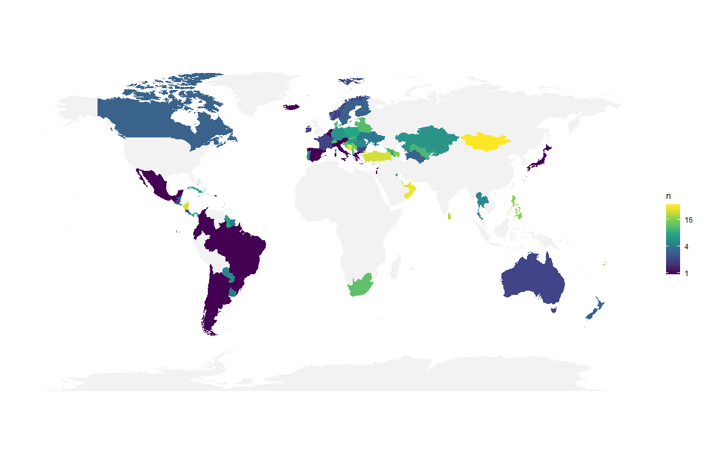
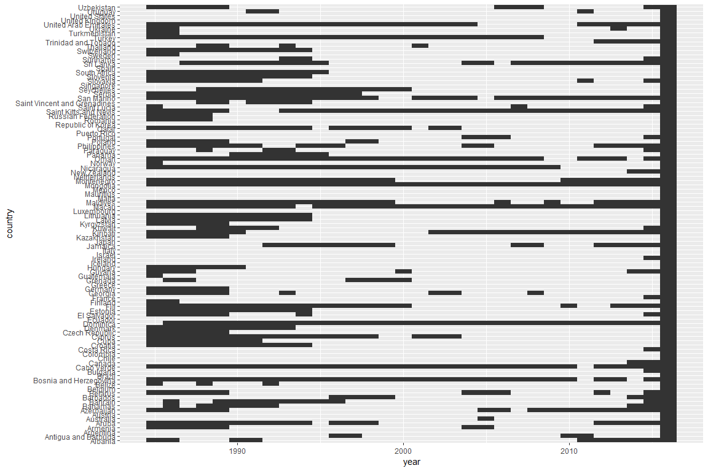
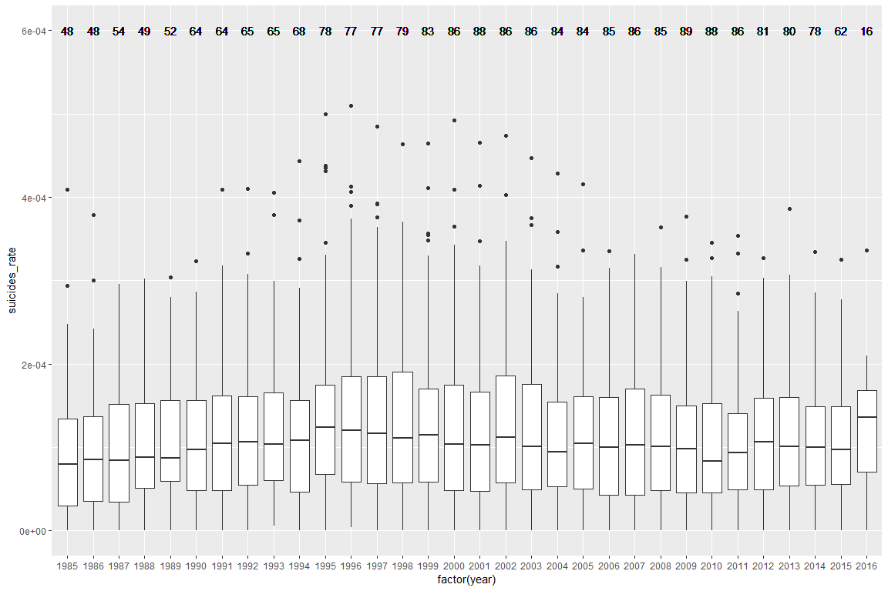
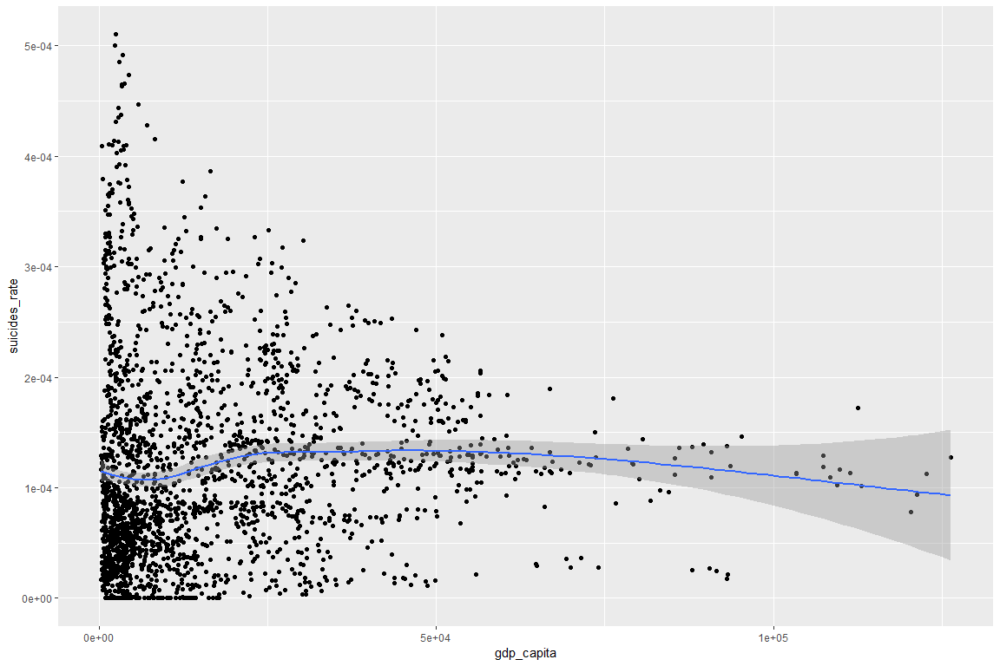
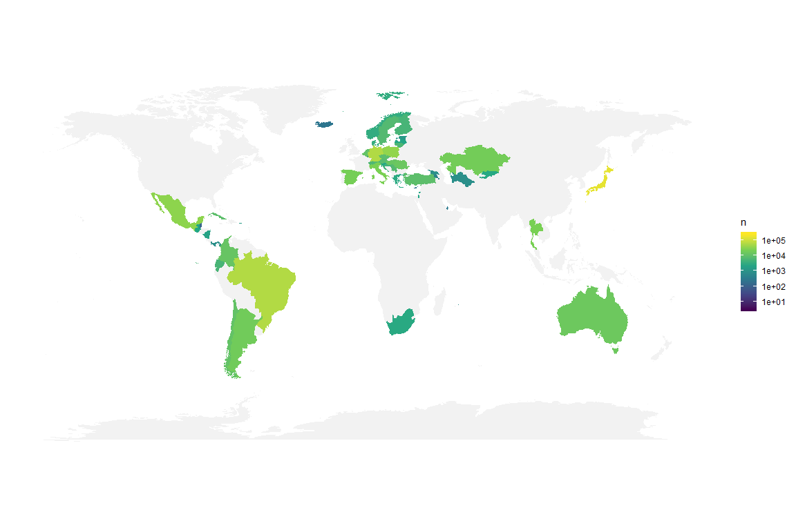
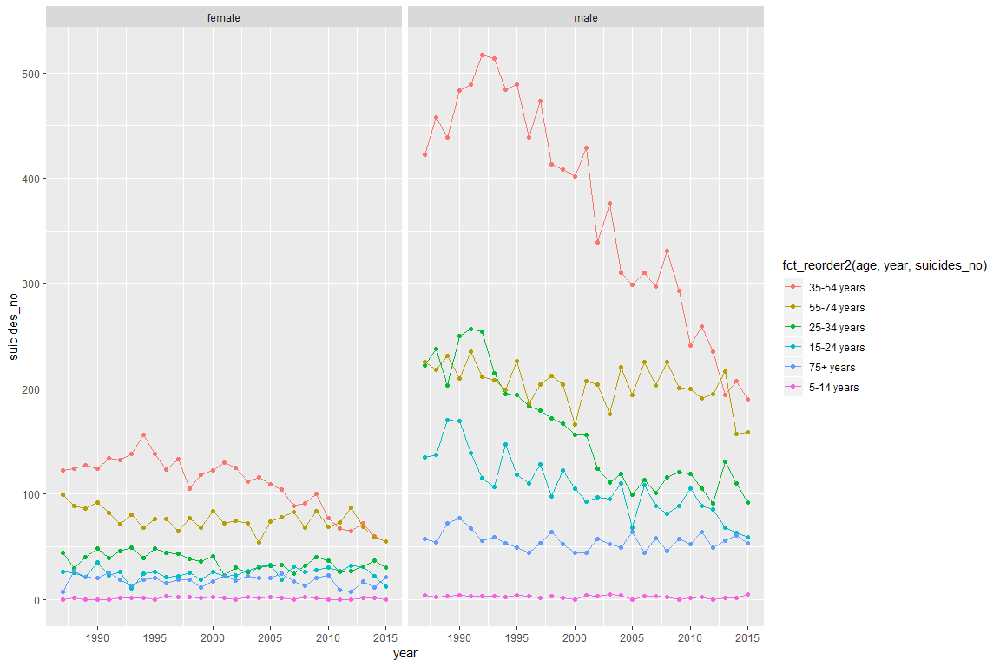
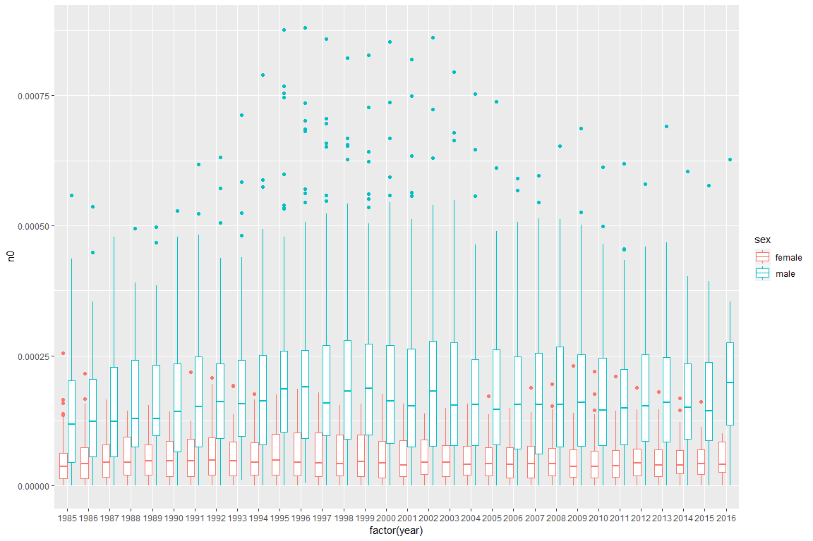

# Load library ------------------


```r
library(tidyverse)
library(skimr)
library(maps)
```

# Load data ------------------


```r
data <- read_csv("./data/master.csv")
```

```
## Parsed with column specification:
## cols(
##   country = col_character(),
##   year = col_double(),
##   sex = col_character(),
##   age = col_character(),
##   suicides_no = col_double(),
##   population = col_double(),
##   `suicides/100k pop` = col_double(),
##   `country-year` = col_character(),
##   `HDI for year` = col_double(),
##   `gdp_for_year ($)` = col_number(),
##   `gdp_per_capita ($)` = col_double(),
##   generation = col_character()
## )
```

```r
data <- data %>% rename(HDI = `HDI for year`,
                        suicides_rate = `suicides/100k pop`,
                        gdp_yearly = `gdp_for_year ($)`,
                        gdp_capita = `gdp_per_capita ($)`)
```

# Load extra data for worldmaps and statistics

## For world map


```r
library(maps)

world <- map_data("world")
world[world$region == "Antigua" | world$region == "Barbuda",]$region <- "Antigua and Barbuda"
world[world$region == "Cape Verde",]$region <- "Cabo Verde"
world[world$region == "South Korea",]$region <- "Republic of Korea"
world[world$region == "Russia",]$region <- "Russian Federation"
world[world$region == "Saint Kitts" | world$region == "Nevis",]$region <- "Saint Kitts and Nevis"
world[world$region == "Saint Vincent" | world$region == "Grenadines",]$region <- "Saint Vincent and Grenadines"
world[world$region == "Trinidad" | world$region == "Tobago",]$region <- "Trinidad and Tobago"
world[world$region == "UK",]$region <- "United Kingdom"
world[world$region == "USA",]$region <- "United States"
world[world$subregion == "Macao" & !is.na(world$subregion),]$region <- "Macau"

worldmap <- ggplot(data = world, aes(long, lat, group = group)) + geom_polygon(fill = "#f2f2f2") +
  theme(panel.background = element_blank(),
                   axis.title = element_blank(),
                   axis.line.x = element_blank(),
                   axis.ticks = element_blank(),
                   axis.text = element_blank()) +
   coord_fixed(1.2)
```

## For statistics

- Get area

- Get continents

- Get country codes

Might not be a good idea 


```r
library(wbstats)

# Searching area indicator in the database
# wbsearch(pattern = "area") 

#wb <- wb(country = "all", indicator = "AG.SRF.TOTL.K2", startdate = 1985, enddate = 2016) %>% 
 # rename(year = date) %>% 
#  mutate(year = as.numeric(year))
#temp <- left_join(countrystat, wb, by = c("country" = "country", "year" = "year"))

#countries <- wbcountries()

#temp %>% filter(is.na(iso3c)) %>% view()
```


# Data Exploratory ----------------------- 

## Have a look


```r
summary(data)
```

```
##    country               year          sex                age           
##  Length:27820       Min.   :1985   Length:27820       Length:27820      
##  Class :character   1st Qu.:1995   Class :character   Class :character  
##  Mode  :character   Median :2002   Mode  :character   Mode  :character  
##                     Mean   :2001                                        
##                     3rd Qu.:2008                                        
##                     Max.   :2016                                        
##                                                                         
##   suicides_no        population       suicides_rate    country-year      
##  Min.   :    0.0   Min.   :     278   Min.   :  0.00   Length:27820      
##  1st Qu.:    3.0   1st Qu.:   97498   1st Qu.:  0.92   Class :character  
##  Median :   25.0   Median :  430150   Median :  5.99   Mode  :character  
##  Mean   :  242.6   Mean   : 1844794   Mean   : 12.82                     
##  3rd Qu.:  131.0   3rd Qu.: 1486143   3rd Qu.: 16.62                     
##  Max.   :22338.0   Max.   :43805214   Max.   :224.97                     
##                                                                          
##       HDI          gdp_yearly          gdp_capita      generation       
##  Min.   :0.483   Min.   :4.692e+07   Min.   :   251   Length:27820      
##  1st Qu.:0.713   1st Qu.:8.985e+09   1st Qu.:  3447   Class :character  
##  Median :0.779   Median :4.811e+10   Median :  9372   Mode  :character  
##  Mean   :0.777   Mean   :4.456e+11   Mean   : 16866                     
##  3rd Qu.:0.855   3rd Qu.:2.602e+11   3rd Qu.: 24874                     
##  Max.   :0.944   Max.   :1.812e+13   Max.   :126352                     
##  NA's   :19456
```

- country-year column is just a concatenation of country and year column

- suicides/100k pop is calculated by suicides / population * 100000

- HDI is Human Development Report, seems missing alot, the only variable is missing

- Age is divided into brackets

## A closer look:


```r
skim_with(numeric = list(hist = NULL))
skim(data) 
```

```
## Skim summary statistics
##  n obs: 27820 
##  n variables: 12 
## 
## -- Variable type:character ---------------------------------------------------------------------------------------------
##      variable missing complete     n min max empty n_unique
##           age       0    27820 27820   9  11     0        6
##       country       0    27820 27820   4  28     0      101
##  country-year       0    27820 27820   8  32     0     2321
##    generation       0    27820 27820   6  15     0        6
##           sex       0    27820 27820   4   6     0        2
## 
## -- Variable type:numeric -----------------------------------------------------------------------------------------------
##       variable missing complete     n          mean            sd
##     gdp_capita       0    27820 27820   16866.46      18887.58   
##     gdp_yearly       0    27820 27820       4.5e+11       1.5e+12
##            HDI   19456     8364 27820       0.78          0.093  
##     population       0    27820 27820 1844793.62    3911779.44   
##    suicides_no       0    27820 27820     242.57        902.05   
##  suicides_rate       0    27820 27820      12.82         18.96   
##           year       0    27820 27820    2001.26          8.47   
##          p0      p25          p50           p75         p100
##   251        3447      9372         24874       126352      
##     4.7e+07 9e+09         4.8e+10       2.6e+11      1.8e+13
##     0.48        0.71      0.78          0.85         0.94   
##   278       97498.5  430150       1486143.25         4.4e+07
##     0           3        25           131        22338      
##     0           0.92      5.99         16.62       224.97   
##  1985        1995      2002          2008         2016
```

There are:

- 6 Age brackets

- 101 differenet countries in this data set

- Year from 1985 to 2016. (32 years)

- 2321 combinations of country-year (less than 32 * 101). Must be some implicit missing data with year and country

- 6 different generations

- 2 Sex

## Extract country stats

HDI, GDP per year and per capital are values based on country so it makes sense to extract those values into another 
dataframe


```r
countrystat <- data %>% select(country, year, gdp_yearly, gdp_capita, HDI) %>% 
  distinct()

data <- data %>% select(-gdp_yearly, -gdp_capita, -HDI, -`country-year`)
```


## Review implicit missing data


```r
data <- data %>% complete(country, year, sex, age)
```

Patter of missing data


```r
data %>% group_by(country, year) %>% 
  summarise(miss = sum(is.na(suicides_no))) %>% 
  ungroup() %>% count(miss)
```

```
## # A tibble: 3 x 2
##    miss     n
##   <int> <int>
## 1     0  2305
## 2     2    16
## 3    12   911
```


So each country every year can either miss all data, have all data, but there are some country only miss 2 data, Let's review those


```r
data %>% filter(year == 2016) %>% right_join(data %>% group_by(country, year) %>% 
  summarise(miss = sum(is.na(suicides_no))) %>% 
  filter(!miss %in% c(0,12)), by = c("country", "year")) %>% 
  filter(is.na(suicides_no))
```

```
## # A tibble: 32 x 9
##    country  year sex   age   suicides_no population suicides_rate
##    <chr>   <dbl> <chr> <chr>       <dbl>      <dbl>         <dbl>
##  1 Armenia  2016 fema~ 5-14~          NA         NA            NA
##  2 Armenia  2016 male  5-14~          NA         NA            NA
##  3 Austria  2016 fema~ 5-14~          NA         NA            NA
##  4 Austria  2016 male  5-14~          NA         NA            NA
##  5 Croatia  2016 fema~ 5-14~          NA         NA            NA
##  6 Croatia  2016 male  5-14~          NA         NA            NA
##  7 Cyprus   2016 fema~ 5-14~          NA         NA            NA
##  8 Cyprus   2016 male  5-14~          NA         NA            NA
##  9 Czech ~  2016 fema~ 5-14~          NA         NA            NA
## 10 Czech ~  2016 male  5-14~          NA         NA            NA
## # ... with 22 more rows, and 2 more variables: generation <chr>,
## #   miss <int>
```

Data from 2016 are missing with age group 5-14 years old

Let's find out how many missing data with each country each year


```r
data %>% group_by(country, year) %>% summarise(avg_rate = mean(suicides_rate)) %>% summarise(n = sum(is.na(avg_rate))) %>% arrange(desc(n))
```

```
## # A tibble: 101 x 2
##    country                    n
##    <chr>                  <int>
##  1 Mongolia                  32
##  2 Cabo Verde                31
##  3 Dominica                  31
##  4 Macau                     31
##  5 Bosnia and Herzegovina    30
##  6 Oman                      29
##  7 Saint Kitts and Nevis     29
##  8 San Marino                29
##  9 Nicaragua                 26
## 10 United Arab Emirates      26
## # ... with 91 more rows
```

Plot on map


```r
suicides <- data %>% group_by(country, year) %>% summarise(suicides_rate = mean(suicides_rate))

world <- map_data("world")


worldmap + suicides %>% group_by(country) %>% summarise(n = sum(is.na(suicides_rate))) %>% left_join(world, by = c("country" = "region")) %>%  
  geom_polygon(data = ., aes(fill = n))  + scale_fill_viridis_c(trans = "log2")
```

<!-- -->

Most of the data are from Russia, America nand Europe. There are some countries that have a lot of missing data

Missing pattern

```r
data %>% group_by(country, year) %>% summarise(na = sum(is.na(suicides_no))) %>% filter(na > 0) %>% 
  ggplot() + geom_tile(aes(year, country))
```

<!-- -->

There are a lot of random missing data between all

Hierachical clustering


```r
temp <- data %>% group_by(country, year) %>% summarise(na = sum(is.na(suicides_no)))
```


## What is generation's age range?


```r
data %>% filter(!is.na(generation)) %>% 
  separate(age, into =c("min", "max")) %>% mutate(max = ifelse(max== "years", 100, max)) %>% 
  mutate(min = as.integer(min), max = as.integer(max)) %>% 
  mutate(min = year - min, max = year - max) %>% 
  ggplot() + geom_jitter(aes(generation, min, color = "Max possible birth year"), alpha = 0.3) + geom_jitter(aes(generation, max, color = "Min possible birth year"), alpha = 0.3) +
  scale_color_manual(name = "", values = c("green", "red")) + theme(legend.position = "top") + ylab("Birth year")
```

<!-- -->

- Since Age values are not provided but put in the age range, we can only estimate the actual year birth.

From the data, birth year of :

- G.I generation is aroung 1900

- Silent generation is around 1925

- Boomers generation is around 1955

- Generation X is around 1975

- Millennials is around 1980

- Generation Z is around 2000

Compare to Wiki

- G.I generation birth year is from 1900s to late 1920s

- Silent generation birth year is from late 1920s to mid 1940s

- Boomers generation birth year is from 1946 to 1964

- Genration X birth year is from early-to-mid 1960s to the early 1980s

- Millennials birth year is from early 1980s to early 2000s

- Generation Z birth year is from 1990s till now

There is no big discrepancy between data set and Wiki, no outliner either, so it is safe to assume that there is no mistake in our data.

# Combines with other data


Continents

Country size so we can calculate population/area

map package?


# Analyze

## Suicides rate by year

Suicides rate per country per year of all recorded country visualized in boxplot.
The number on top shows number of countries recorded in each year.


```r
data %>% filter(!is.na(suicides_rate)) %>% 
  group_by(country, year) %>% 
  summarise(suicides_rate = sum(suicides_no)/sum(population)) %>%
  ungroup() %>% group_by(year) %>% mutate(n = n()) %>% 
  ggplot(aes(x = factor(year))) + geom_boxplot(aes(y = suicides_rate )) + geom_text(aes(label = n, y = 0.0006))
```

<!-- -->


### By countries


### By continents

## Suides rate by year and Age group

### By countries

### By continents

## GDP

No relation ship between GDP and suicide rate


```r
data %>% group_by(country, year) %>% 
  summarise(suicides_rate = sum(suicides_no)/sum(population)) %>% 
  left_join(countrystat, by = c("country", "year")) %>% 
  ggplot(aes(gdp_capita, suicides_rate)) + geom_point() + geom_smooth(method = "loess")
```

```
## Warning: Removed 927 rows containing non-finite values (stat_smooth).
```

```
## Warning: Removed 927 rows containing missing values (geom_point).
```

<!-- -->

Suicides rate per country per year


# From 2010


```r
worldmap + data %>% filter(year >= 2010 & year < 2016) %>%
  group_by(country) %>% summarise(n = sum(suicides_no)) %>% filter(!is.na(n)) %>% 
  left_join(world, by = c("country" = "region")) %>%  
  geom_polygon(data = ., aes(fill = n))  + scale_fill_viridis_c(trans = "log10")
```

<!-- -->

# Without year

Fit model to predict Suicide rate based on gdp, pop, area

# Year

Population?

# Finland


```r
data %>% filter(country == "Finland") %>% 
  filter(!is.na(suicides_no)) %>% 
  ggplot() + geom_point(aes(year, suicides_no, color = fct_reorder2(age, year, suicides_no))) +
  geom_line(aes(year, suicides_no, colour = age)) + facet_wrap(~sex)
```

<!-- -->


# By gender


```r
data %>% 
  group_by(year, sex, country) %>% 
  summarise(n0 = mean(suicides_no, na.rm = T)/mean(population, na.rm = T)) %>% 
  ggplot(aes(factor(year), n0, color = sex)) + geom_boxplot()
```

```
## Warning: Removed 1822 rows containing non-finite values (stat_boxplot).
```

<!-- -->

