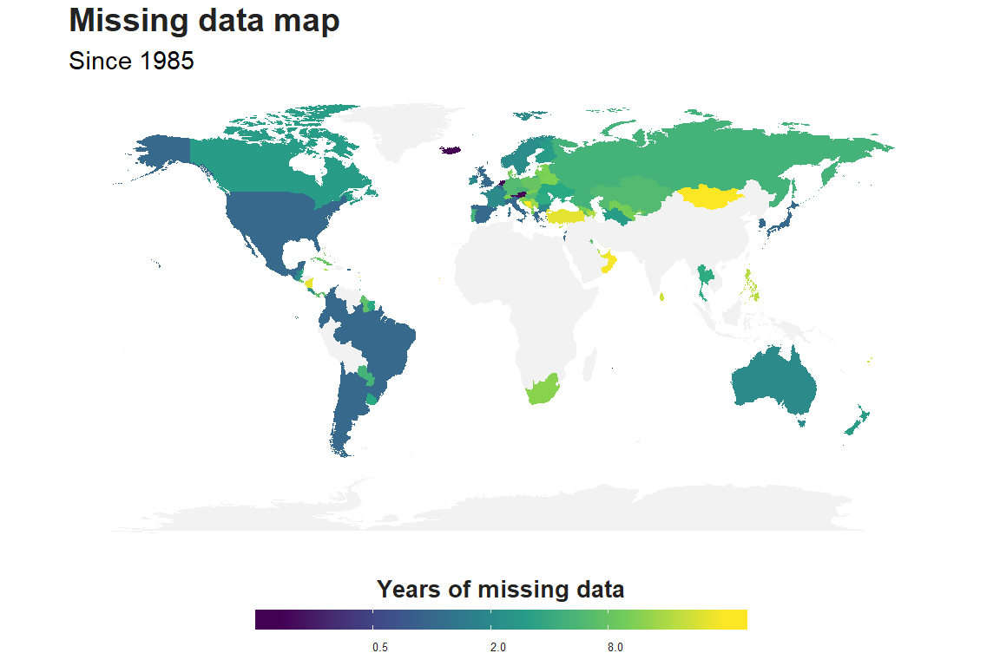
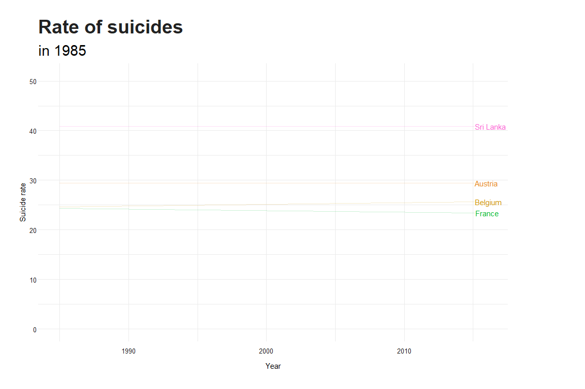
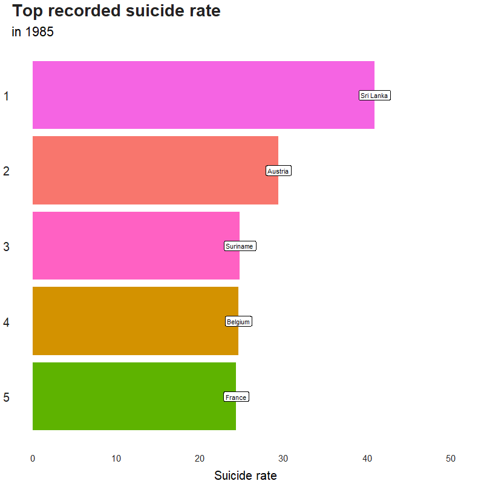
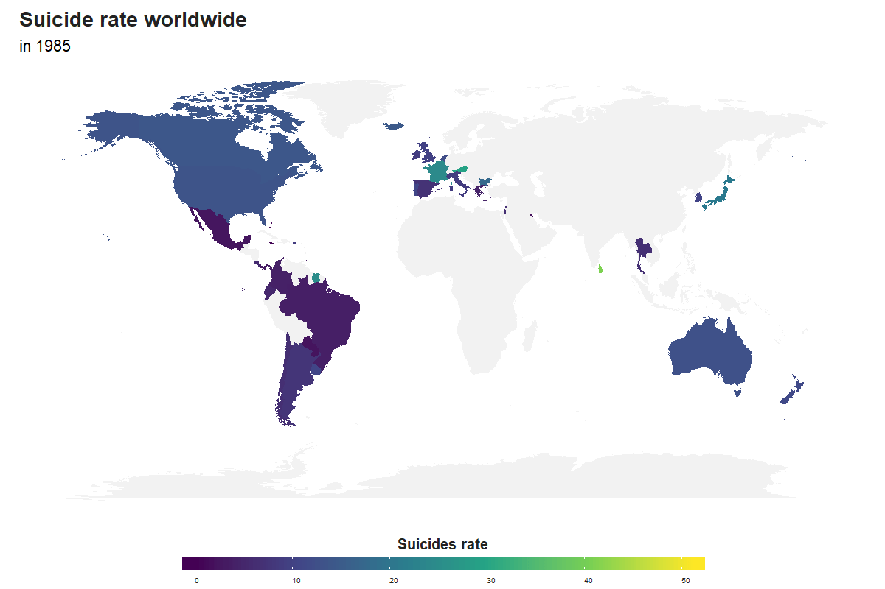
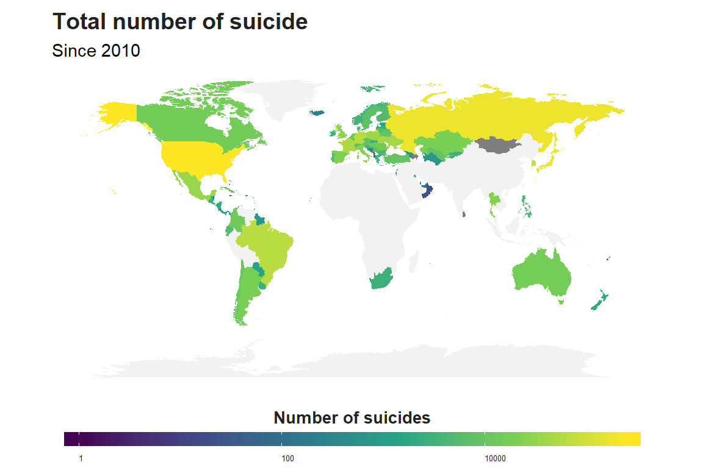
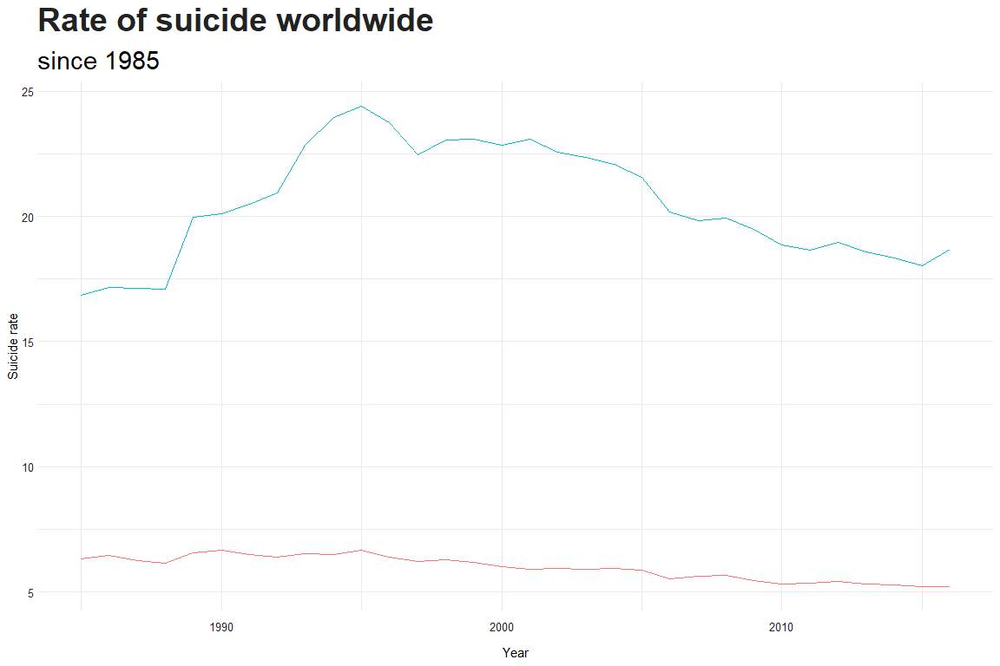
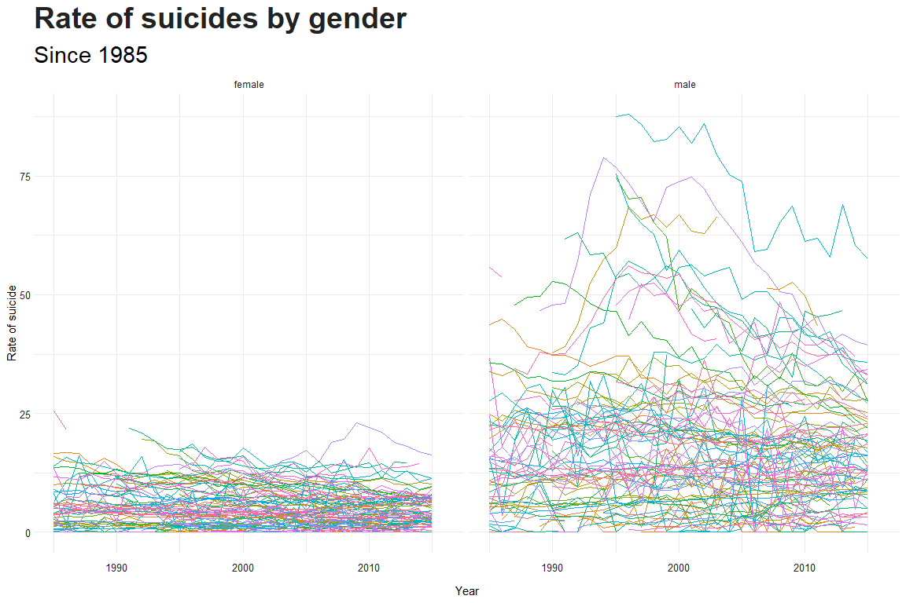
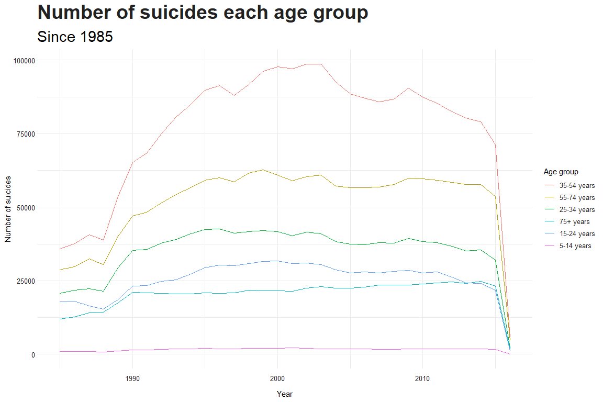
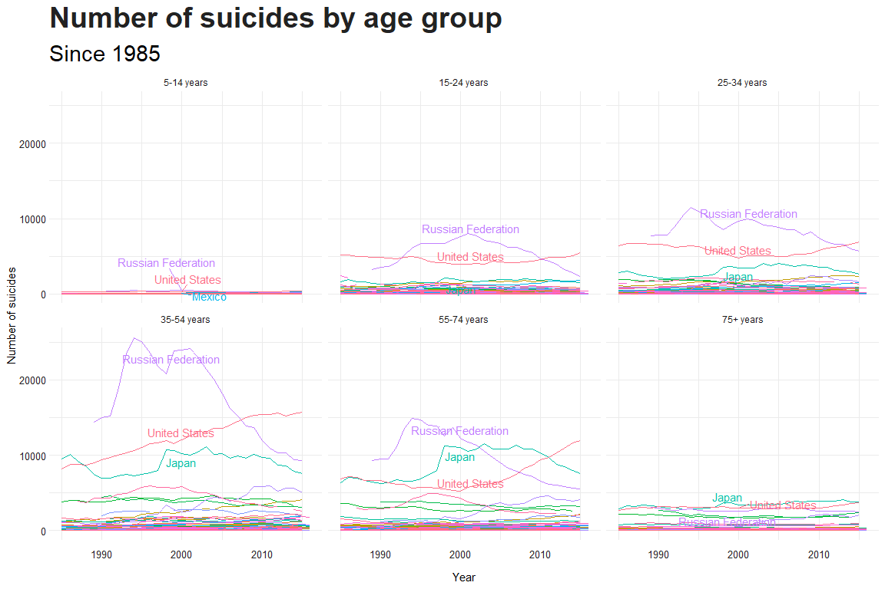
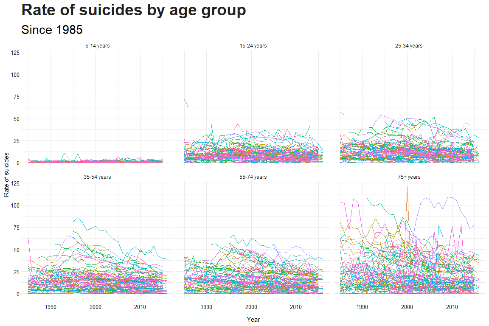

Load library ——————
===================

    library(tidyverse)
    library(skimr)
    library(maps)
    library(gganimate)
    library(ggrepel)
    library(maps)

    theme_set(theme_minimal() +
                theme(panel.background = element_blank(),
                      plot.title = element_text(size = 28,
                                                face = "bold",
                                                color = "#222222"),
                      plot.subtitle = ggplot2::element_text(size=22,
                                                            margin=ggplot2::margin(9,0,9,0)),
                      legend.text.align = 0,
                      legend.background = ggplot2::element_blank(),
                      legend.key = ggplot2::element_blank(),
                      legend.text = ggplot2::element_text(size=10,
                                                          color="#222222"),
                      axis.text = ggplot2::element_text(size=10,
                                                        color="#222222"),
                      axis.text.x = ggplot2::element_text(margin=ggplot2::margin(5, b = 10),
                                                          vjust = 0.5, size = 10),
                      axis.text.y = ggplot2::element_text(margin=ggplot2::margin(5, b = 10), 
                                                          vjust = 0.5, size = 10)))

Load data ——————
================

    data <- read_csv("data/master.csv")
    data <- data %>% rename(HDI = `HDI for year`,
                            suicides_rate = `suicides/100k pop`,
                            gdp_yearly = `gdp_for_year ($)`,
                            gdp_capita = `gdp_per_capita ($)`)
    data$age <- factor(data$age, levels = c("5-14 years", "15-24 years", 
                                            "25-34 years", "35-54 years", 
                                            "55-74 years", "75+ years"))

Load extra data for worldmaps and statistics
============================================

Load world map
--------------

    world <- map_data("world")

Draw world map
--------------

    world[world$region == "Antigua" | world$region == "Barbuda",]$region <- "Antigua and Barbuda"
    world[world$region == "Cape Verde",]$region <- "Cabo Verde"
    world[world$region == "South Korea",]$region <- "Republic of Korea"
    world[world$region == "Russia",]$region <- "Russian Federation"
    world[world$region == "Saint Kitts" | world$region == "Nevis",]$region <- "Saint Kitts and Nevis"
    world[world$region == "Saint Vincent" | world$region == "Grenadines",]$region <- "Saint Vincent and Grenadines"
    world[world$region == "Trinidad" | world$region == "Tobago",]$region <- "Trinidad and Tobago"
    world[world$region == "UK",]$region <- "United Kingdom"
    world[world$region == "USA",]$region <- "United States"
    world[world$subregion == "Macao" & !is.na(world$subregion),]$region <- "Macau"

    worldmap <- ggplot(data = world, aes(long, lat, group = group)) + geom_polygon(fill = "#f2f2f2") +
      theme(panel.background = element_blank(),
                       axis.title = element_blank(),
                       axis.line.x = element_blank(),
                       axis.ticks = element_blank(),
                       axis.text = element_blank()) +
       coord_fixed(1.2)

Add EU
------

    eu <- read_csv("data/listofeucountries.csv") %>% pull(x)

    eu <- replace(eu, eu == "Slovak Republic", "Slovakia")

Data Exploratory ———————–
=========================

Have a look
-----------

    summary(data)

    ##    country               year          sex                     age      
    ##  Length:27820       Min.   :1985   Length:27820       5-14 years :4610  
    ##  Class :character   1st Qu.:1995   Class :character   15-24 years:4642  
    ##  Mode  :character   Median :2002   Mode  :character   25-34 years:4642  
    ##                     Mean   :2001                      35-54 years:4642  
    ##                     3rd Qu.:2008                      55-74 years:4642  
    ##                     Max.   :2016                      75+ years  :4642  
    ##                                                                         
    ##   suicides_no        population       suicides_rate    country-year      
    ##  Min.   :    0.0   Min.   :     278   Min.   :  0.00   Length:27820      
    ##  1st Qu.:    3.0   1st Qu.:   97498   1st Qu.:  0.92   Class :character  
    ##  Median :   25.0   Median :  430150   Median :  5.99   Mode  :character  
    ##  Mean   :  242.6   Mean   : 1844794   Mean   : 12.82                     
    ##  3rd Qu.:  131.0   3rd Qu.: 1486143   3rd Qu.: 16.62                     
    ##  Max.   :22338.0   Max.   :43805214   Max.   :224.97                     
    ##                                                                          
    ##       HDI          gdp_yearly          gdp_capita      generation       
    ##  Min.   :0.483   Min.   :4.692e+07   Min.   :   251   Length:27820      
    ##  1st Qu.:0.713   1st Qu.:8.985e+09   1st Qu.:  3447   Class :character  
    ##  Median :0.779   Median :4.811e+10   Median :  9372   Mode  :character  
    ##  Mean   :0.777   Mean   :4.456e+11   Mean   : 16866                     
    ##  3rd Qu.:0.855   3rd Qu.:2.602e+11   3rd Qu.: 24874                     
    ##  Max.   :0.944   Max.   :1.812e+13   Max.   :126352                     
    ##  NA's   :19456

-   country-year column is just a concatenation of country and year
    column

-   suicides/100k pop is calculated by suicides / population \* 100000

-   HDI is Human Development Report, seems missing alot, the only
    variable is missing

-   Age is divided into brackets

A closer look:
--------------

    skim_with(numeric = list(hist = NULL))
    skim(data) 

    ## Skim summary statistics
    ##  n obs: 27820 
    ##  n variables: 12 
    ## 
    ## -- Variable type:character ---------------------------------------------------------------------------------------------
    ##      variable missing complete     n min max empty n_unique
    ##       country       0    27820 27820   4  28     0      101
    ##  country-year       0    27820 27820   8  32     0     2321
    ##    generation       0    27820 27820   6  15     0        6
    ##           sex       0    27820 27820   4   6     0        2
    ## 
    ## -- Variable type:factor ------------------------------------------------------------------------------------------------
    ##  variable missing complete     n n_unique
    ##       age       0    27820 27820        6
    ##                                  top_counts ordered
    ##  15-: 4642, 25-: 4642, 35-: 4642, 55-: 4642   FALSE
    ## 
    ## -- Variable type:numeric -----------------------------------------------------------------------------------------------
    ##       variable missing complete     n          mean            sd
    ##     gdp_capita       0    27820 27820   16866.46      18887.58   
    ##     gdp_yearly       0    27820 27820       4.5e+11       1.5e+12
    ##            HDI   19456     8364 27820       0.78          0.093  
    ##     population       0    27820 27820 1844793.62    3911779.44   
    ##    suicides_no       0    27820 27820     242.57        902.05   
    ##  suicides_rate       0    27820 27820      12.82         18.96   
    ##           year       0    27820 27820    2001.26          8.47   
    ##          p0      p25          p50           p75         p100
    ##   251        3447      9372         24874       126352      
    ##     4.7e+07 9e+09         4.8e+10       2.6e+11      1.8e+13
    ##     0.48        0.71      0.78          0.85         0.94   
    ##   278       97498.5  430150       1486143.25         4.4e+07
    ##     0           3        25           131        22338      
    ##     0           0.92      5.99         16.62       224.97   
    ##  1985        1995      2002          2008         2016

There are:

-   6 Age brackets

-   101 differenet countries in this data set

-   Year from 1985 to 2016. (32 years)

-   2321 combinations of country-year (less than 32 \* 101). Must be
    some implicit missing data with year and country

-   6 different generations

-   2 Sex

Extract country stats
---------------------

HDI, GDP per year and per capital are values based on country so it
would make sense to extract those values into another dataframe

    countrystat <- data %>% select(country, year, gdp_yearly, gdp_capita, HDI) %>% 
      distinct()

    data <- data %>% select(-gdp_yearly, -gdp_capita, -HDI, -`country-year`)

Review implicit missing data
----------------------------

    data <- data %>% complete(country, year, sex, age)

Pattern of missing data

    data %>% group_by(country, year) %>% 
      summarise(miss = sum(is.na(suicides_no))) %>% 
      ungroup() %>% count(miss)

    ## # A tibble: 3 x 2
    ##    miss     n
    ##   <int> <int>
    ## 1     0  2305
    ## 2     2    16
    ## 3    12   911

So each country every year can either miss all data, have all data, but
there are some country only miss 2 data, Let’s review those

    data %>% filter(year == 2016) %>% right_join(data %>% group_by(country, year) %>% 
      summarise(miss = sum(is.na(suicides_no))) %>% 
      filter(!miss %in% c(0,12)), by = c("country", "year")) %>% 
      filter(is.na(suicides_no))

    ## # A tibble: 32 x 9
    ##    country  year sex   age   suicides_no population suicides_rate
    ##    <chr>   <dbl> <chr> <fct>       <dbl>      <dbl>         <dbl>
    ##  1 Armenia  2016 fema~ 5-14~          NA         NA            NA
    ##  2 Armenia  2016 male  5-14~          NA         NA            NA
    ##  3 Austria  2016 fema~ 5-14~          NA         NA            NA
    ##  4 Austria  2016 male  5-14~          NA         NA            NA
    ##  5 Croatia  2016 fema~ 5-14~          NA         NA            NA
    ##  6 Croatia  2016 male  5-14~          NA         NA            NA
    ##  7 Cyprus   2016 fema~ 5-14~          NA         NA            NA
    ##  8 Cyprus   2016 male  5-14~          NA         NA            NA
    ##  9 Czech ~  2016 fema~ 5-14~          NA         NA            NA
    ## 10 Czech ~  2016 male  5-14~          NA         NA            NA
    ## # ... with 22 more rows, and 2 more variables: generation <chr>,
    ## #   miss <int>

Data from 2016 are missing with age group 5-14 years old

Let’s find out how many missing data with each country each year

    data %>% group_by(country, year) %>% summarise(avg_rate = mean(suicides_rate)) %>% summarise(n = sum(is.na(avg_rate))) %>% arrange(desc(n))

    ## # A tibble: 101 x 2
    ##    country                    n
    ##    <chr>                  <int>
    ##  1 Mongolia                  32
    ##  2 Cabo Verde                31
    ##  3 Dominica                  31
    ##  4 Macau                     31
    ##  5 Bosnia and Herzegovina    30
    ##  6 Oman                      29
    ##  7 Saint Kitts and Nevis     29
    ##  8 San Marino                29
    ##  9 Nicaragua                 26
    ## 10 United Arab Emirates      26
    ## # ... with 91 more rows

Plot on map

    worldmap + data %>% 
      group_by(country, year) %>% 
      summarise(n = sum(is.na(suicides_rate))/12) %>%
      ungroup()  %>% 
      group_by(country) %>% 
      summarise(n = sum(n)) %>% 
      left_join(world, by = c("country" = "region")) %>%  
      geom_polygon(data = ., aes(fill = n))  + 
      scale_fill_viridis_c(trans = "log2", name = "Years of missing data", 
                           guide = guide_colorbar(title.position = "top", 
                                                  direction = "horizontal",
                                                  nbin = 10)) +
      labs(title = "Missing data map", subtitle = "Since 1985") +
      theme(legend.position = "bottom",
            legend.justification = "center",
            legend.key.width = unit(3,"cm"),
            panel.grid = element_blank(),
            axis.text = element_blank(),
            axis.text.x = element_blank(),
            axis.text.y = element_blank(), 
            legend.title.align = 0.5,
            legend.title = element_text(size = 20, face = "bold", color = "#222222"))

Most of the data are from Russia, America nand Europe. There are some
countries that have a lot of missing data

Missing pattern

    data %>% 
      group_by(country, year) %>% 
      summarise(na = sum(is.na(suicides_no))) %>% 
      filter(na > 0) %>% 
      ggplot(aes(year, country, group = country)) + 
      geom_tile() + 
      theme( panel.grid = element_blank()) +
      scale_x_continuous(expand = c(0,0)) + 
      labs(title = "Pattern of missing data")

There are a lot of random missing data through out the years

What is generation’s age range?
-------------------------------

    data %>% filter(!is.na(generation)) %>% 
      separate(age, into =c("min", "max")) %>% mutate(max = ifelse(max== "years", 100, max)) %>% 
      mutate(min = as.integer(min), max = as.integer(max)) %>% 
      mutate(min = year - min, max = year - max) %>% 
      ggplot() + geom_jitter(aes(generation, min, color = "Max possible birth year"), alpha = 0.3) +
      geom_jitter(aes(generation, max, color = "Min possible birth year"), alpha = 0.3) +
      scale_color_manual(name = "", values = c("green", "red")) + theme(legend.position = "top") + 
      labs(title = "Birth year of all generations", y = "Birth year", x = "Generations")

-   Since Age values are not provided but put in the age range, we can
    only estimate the actual year birth.

From the data, birth year of :

-   G.I generation is aroung 1900

-   Silent generation is around 1925

-   Boomers generation is around 1955

-   Generation X is around 1975

-   Millennials is around 1980

-   Generation Z is around 2000

Compare to Wiki

-   G.I generation birth year is from 1900s to late 1920s

-   Silent generation birth year is from late 1920s to mid 1940s

-   Boomers generation birth year is from 1946 to 1964

-   Genration X birth year is from early-to-mid 1960s to the early 1980s

-   Millennials birth year is from early 1980s to early 2000s

-   Generation Z birth year is from 1990s till now

There is no big discrepancy between data set and Wiki, no outliner
either, so it is safe to assume that there is no mistake in our data.

Analyze
=======

Suicides rate by year all over the world
----------------------------------------

Set up data

    rate <- data %>% 
      group_by(country, year) %>% 
      summarise(suicides_rate = sum(suicides_no)/sum(population) * 1e5) %>% 
      ungroup()

### Suicides rate per country per year of all recorded country visualized in boxplot.

The number on top shows number of countries recorded in each year.

    rate %>%
      filter(!is.na(suicides_rate)) %>% group_by(year) %>% mutate(n = n()) %>% 
      ggplot(aes(x = factor(year))) +
      geom_boxplot(aes(y = suicides_rate )) + 
      geom_text(aes(label = n, y = 55)) +
      theme(axis.text.x = element_text(angle = 45)) +
      labs(title = "Distribution of suicide rate of all country", subtitle = "Since 1985" , y = "Suicide rate", x = "Year")

There is no noticable trend

### Rate of suicides per country

    rate %>% 
      ggplot(aes(year, suicides_rate, color = country)) + 
      geom_line() +
      geom_text_repel(data = . %>% ungroup() %>%
                        group_by(year) %>% 
                        top_n(n = 5, wt = suicides_rate) %>%
                        ungroup() %>% 
                        complete(country, year),
                      aes(label = country), hjust = 0,  
                      segment.alpha = 0.2, xlim = c(2015,NA)) +
      coord_cartesian(clip = "off") +
      theme(legend.position = "none",
            plot.margin = margin(1,4,1,1, "cm")) +
      labs(title = "Rate of suicides", subtitle = "in {round(frame_along)}", x = "Year", y = "Suicide rate") +
      transition_reveal(year) 

### Top recorded suicide rate in each year with barplot

    (rate %>% ungroup() %>%
      group_by(year) %>% 
      top_n(n = 5, wt = suicides_rate) %>% 
      mutate(rank = rank(-suicides_rate)) %>% 
      ggplot(aes(rank, suicides_rate, fill = country)) + 
      geom_col() +
      geom_label(aes(label = country ),fill = "white") +
      theme(legend.position = "none",
            panel.grid = element_blank(),
            axis.title.y = element_blank(),
            axis.text.x = element_text(size = 15),
            axis.text.y = element_text(size = 20),
            axis.title.x = element_text(size = 20)) +
      scale_x_reverse() +
      coord_flip() +
      transition_states(year, transition_length = 2, state_length = 2) +
      labs(subtitle = "in {closest_state}", title = "Top recorded suicide rate", y = "Suicide rate")+
      enter_drift(x_mod = -1) + exit_drift(x_mod = 1)) %>% 
      animate(nframes = 300, height = 800, width = 800 )

### Recorded suicides rate in each year with map

    (worldmap +
       geom_polygon(data = rate %>%
                      left_join(world, by = c("country" = "region")) %>% 
                      filter(!is.na(suicides_rate)),
                    aes(fill = suicides_rate))  + 
       scale_fill_viridis_c(name = "Suicides rate", 
                           guide = guide_colorbar(title.position = "top", 
                                                  direction = "horizontal"),
                           na.value  = "#f2f2f2") +
      theme(legend.position = "bottom",
            legend.key.width = unit(5,"cm"),
            legend.title = element_text(size = 20, face = "bold", color = "#222222"),
            legend.title.align = 0.5,
            panel.grid = element_blank(),
            plot.margin = margin(15,1,1,1),
            axis.text.x = element_blank(),
            axis.text.y = element_blank()) +
      labs(subtitle = "in {closest_state}", title = "Suicide rate worldwide")+
      transition_states(year)) %>% 
      animate(duration = 20, height = 800, width = 1200)

### Top 10 biggest increase in suicide rate in 1 year all time

    rate %>% 
      mutate(lag = suicides_rate - lag(suicides_rate)) %>% 
      top_n(10, lag) %>% 
      arrange(desc(lag))

    ## # A tibble: 10 x 4
    ##    country      year suicides_rate   lag
    ##    <chr>       <dbl>         <dbl> <dbl>
    ##  1 Montenegro   2007         20.6  20.6 
    ##  2 Montenegro   2005         20.2  20.2 
    ##  3 Guyana       1999         24.8  19.5 
    ##  4 Kiribati     1993         18.8  12.4 
    ##  5 Mauritius    1987         15.4  12.2 
    ##  6 Slovakia     2008         11.5  11.5 
    ##  7 Suriname     2006         24.7   8.62
    ##  8 Suriname     1991         15.7   8.24
    ##  9 Saint Lucia  2009          8.13  8.13
    ## 10 Iceland      1990         17.1   7.66

### Top 10 biggest decrease in suicide rate in 1 year

    rate %>% 
      mutate(lag = suicides_rate - lag(suicides_rate)) %>% 
      top_n(10, -lag) %>% 
      arrange(lag)

    ## # A tibble: 10 x 4
    ##    country                       year suicides_rate    lag
    ##    <chr>                        <dbl>         <dbl>  <dbl>
    ##  1 Montenegro                    2006          0    -20.2 
    ##  2 Slovakia                      2006          0    -13.2 
    ##  3 Kiribati                      1995          3.03 -12.4 
    ##  4 Seychelles                    1986          1.74 -12.2 
    ##  5 Suriname                      1986         12.9  -11.9 
    ##  6 Saint Vincent and Grenadines  2013          0     -9.98
    ##  7 Kiribati                      1992          6.36  -9.80
    ##  8 Luxembourg                    2003         11.3   -9.00
    ##  9 Suriname                      1996          5.31  -8.82
    ## 10 Mauritius                     1986          3.12  -8.66

Based on this, more information can be obtained to get a further insight
of the events in these countries

### Biggest changes

    (ggplot(data = rate %>% filter(country %in% (rate %>% group_by(country) %>% 
      filter(!is.na(suicides_rate)) %>% 
      summarise(delta = max(suicides_rate, na.rm = T) - min(suicides_rate, na.rm = T)) %>% 
      arrange(desc(delta)) %>% 
      top_n(10, delta) %>% pull(country))),aes(year, suicides_rate, color = country) ) + 
      geom_line() +
      geom_text_repel(aes(label = country), xlim = c(2020, NA), hjust = 0, segment.alpha = 0.2) +
      coord_cartesian(clip = "off") +
      theme(legend.position = "none",
            plot.margin = margin(1, 3.5, 1, 1, "cm")) +
      labs(title = "Top changes in rate of suicide", subtitle = "in {round(frame_along)}", x = "Year", y = "Suicide rate") +
      transition_reveal(year)) %>% 
      animate(duration = 20)

### Suicide rate by GDP

    rate %>% left_join(countrystat) %>% 
      ggplot(aes(suicides_rate, gdp_capita)) + 
      geom_point() +
      labs(y = "GDP per capita", x = "Suicide rate", title = "Suicide rate by GDP", subtitle = "Since 1985")

There is no indication of a relationship between them

Number of suicides per country
------------------------------

Prepare data

    n_suicides <- data %>% 
      group_by(country,year) %>% 
      summarise(n = sum(suicides_no))

### Number of suicides per country each year

    n_suicides %>% 
      ggplot(aes(year, n, color = country)) +
      geom_line() +  
      geom_text_repel(data = . %>% ungroup() %>%
                        group_by(year) %>% 
                        top_n(n = 5, wt = n) %>%
                        ungroup() %>% 
                        complete(country, year), 
                      aes(label = country ), xlim = c(2015,NA), hjust = 0,
                      segment.alpha = 0.2) + 
      coord_cartesian(clip = 'off') +
      theme(legend.position = "none",  
            plot.margin = margin(1,4,1,1, "cm")) +
      labs(title = "Number of suicides", subtitle = "in {round(frame_along)}", x = "Year", y = "Number of rate") +
      transition_reveal(year)

From 2010
---------

Total number of suicide since 2010

    worldmap + data %>% filter(year >= 2010 & year < 2016) %>%
      group_by(country) %>% 
      summarise(n = sum(suicides_no, na.rm = T)) %>%
      filter(!is.na(n)) %>%
      left_join(world, by = c("country" = "region")) %>%  
      geom_polygon(data = ., aes(fill = n))  + 
      scale_fill_viridis_c(name = "Number of suicides",
                           trans = "log10",
                           guide = guide_colorbar(title.position = "top", 
                                                  direction = "horizontal")) +
      labs(title = "Total number of suicide", subtitle = "Since 2010") +
      theme(legend.position = "bottom",
            legend.key.width = unit(5,"cm"),
            legend.title = element_text(size = 20, face = "bold", color = "#222222"),
            legend.title.align = 0.5,
            panel.grid = element_blank(),
            plot.margin = margin(15,1,1,1),
            axis.text.x = element_blank(),
            axis.text.y = element_blank())

    ## Warning: Transformation introduced infinite values in discrete y-axis

### Average rate of suicide since 2010

    worldmap + rate %>% filter(year >= 2010 & year < 2016) %>%
      group_by(country) %>% summarise(n = mean(suicides_rate, na.rm = T)) %>% filter(!is.na(n)) %>% 
      left_join(world, by = c("country" = "region")) %>%  
      geom_polygon(data = ., aes(fill = n))  + 
      scale_fill_viridis_c(name = "Average number of suicides",
                           guide = guide_colorbar(title.position = "top", 
                                                  direction = "horizontal")) +
      labs(title = "Average rate of suicide", subtitle = "Since 2010") +
      theme(legend.position = "bottom",
            legend.key.width = unit(5,"cm"),
            legend.title = element_text(size = 20, face = "bold", color = "#222222"),
            legend.title.align = 0.5,
            panel.grid = element_blank(),
            plot.margin = margin(15,1,1,1),
            axis.text.x = element_blank(),
            axis.text.y = element_blank())

Gender
------

### Number of suicides by gender each year in the world

    data %>% group_by(year, sex) %>% 
      summarise(suicides_no = sum(suicides_no, na.rm = T)) %>% 
      ggplot(aes(year, suicides_no, color = sex)) + 
      geom_line() + 
      theme(legend.position = "none") +
      labs(title = "Number of suicide worldwide", x = "Year", y = "Suicide number", subtitle = "since 1985")

### Rate of suicides by gender each year in the world

    data %>% group_by(year, sex) %>% 
      summarise(suicides_no = sum(suicides_no, na.rm = T)/ sum(population, na.rm = T) * 1e5) %>% 
      ggplot(aes(year, suicides_no, color = sex)) + 
      geom_line() + 
      theme(legend.position = "none") +
      labs(title = "Rate of suicide worldwide", x = "Year", y = "Suicide rate", subtitle = "since 1985")

### Number of suicides by gender each year in every country

    data %>% group_by(country, year, sex) %>% 
      summarise(suicides_no = sum(suicides_no)) %>% 
      ggplot(aes(year, suicides_no, color = country)) + 
      geom_line() + facet_wrap(~sex) +
      theme(legend.position = "none") +
      labs(title = "Number of suicides by gender", subtitle = "Since 1985", x = "Year",
           y = "Number of suicide")

    ## Warning: Removed 807 rows containing missing values (geom_path).

### Rate of suicides by gender each year in every country

    data %>% group_by(country, year, sex) %>% 
      summarise(suicides_rate = sum(suicides_no)/sum(population) * 1e5) %>% 
      ggplot(aes(year, suicides_rate, color = country)) + 
      geom_line() + facet_wrap(~sex) +
      theme(legend.position = "none") +  
      labs(title = "Rate of suicides by gender", subtitle = "Since 1985", x = "Year",
           y = "Rate of suicide")

    ## Warning: Removed 807 rows containing missing values (geom_path).

Age group
---------

### Number of suicides each age group in the world

    data %>% group_by(year, age) %>% 
      summarise(suicides_no = sum(suicides_no, na.rm = T)) %>% 
      ggplot(aes(year, suicides_no, color = fct_reorder2(age, year, suicides_no))) + 
      geom_line() +
      scale_color_discrete(name = "Age group") +
      labs(title = "Number of suicides each age group", subtitle = "Since 1985", x = "Year",
           y = "Number of suicides")

Number of suicides in 35-54 age group is the biggest due to large
population proportion, in the next graph, age group 75+ actually has the
highest suicide rate

### Rate of suicides each age group in the world

    data %>% group_by(year, age) %>% 
      summarise(suicides_rate = sum(suicides_no, na.rm = T)/sum(population, na.rm = T) * 1e5) %>% 
      ggplot(aes(year, suicides_rate, color = fct_reorder2(age, year, suicides_rate))) + 
      geom_line() +
      scale_color_discrete(name = "Age group") +
      labs(title = "Rate of suicides each age group", subtitle = "Since 1985", x = "Year",
           y = "Rate of suicides")

    ## Warning: Removed 1 rows containing missing values (geom_path).

### Number of suicides by age group each year in every country

    data %>% group_by(country, year, age) %>% 
      summarise(suicides_no = sum(suicides_no)) %>% 
      ggplot(aes(year, suicides_no, color = country)) + 
      geom_line() +
      geom_text_repel(data = data %>% 
                  group_by(country, year, age) %>% 
                  summarise(suicides_no = sum(suicides_no)) %>% 
                  filter(year == 2000) %>% 
                  ungroup() %>% 
                  group_by(age, year) %>% 
                  top_n(3,suicides_no),
                aes(label = country))+
      facet_wrap(~ age) +
      theme(legend.position = "none") +
      labs(title = "Number of suicides by age group", subtitle = "Since 1985",
           x = "Year", y = "Number of suicides")

    ## Warning: Removed 791 rows containing missing values (geom_path).

### Rate of suicides by age group each year in every country

    data %>% group_by(country, year, age) %>% 
      summarise(suicides_rate = sum(suicides_no)/sum(population)*1e5) %>% 
      ggplot(aes(year, suicides_rate, color = country)) + 
      geom_line() + facet_wrap(~ age) +
      theme(legend.position = "none") +
      labs(title = "Rate of suicides by age group", subtitle = "Since 1985",
           x = "Year", y = "Rate of suicides")

    ## Warning: Removed 791 rows containing missing values (geom_path).

### Rate of suicides by age group and sex

    data %>% group_by(country, year, age, sex) %>% 
      summarise(suicides_rate = sum(suicides_no)/sum(population)*1e5) %>% 
      ggplot(aes(year, suicides_rate, color = country)) + 
      geom_line() + facet_grid(age ~ sex)+
      theme(legend.position = "none") +
      labs(title = "Number of suicides by age and sex", subtitle = "Since 1985",
           x = "Year", y = "Number of suicides")

    ## Warning: Removed 823 rows containing missing values (geom_path).

EU
--

EU background map

    EUmap <- ggplot(data = world %>% 
                      filter(region %in% eu), aes(long, lat, group = group)) + geom_polygon(fill = "#f2f2f2") +
      theme(panel.background = element_blank(),
                       axis.title = element_blank(),
                       axis.line.x = element_blank(),
                       axis.ticks = element_blank(),
                       axis.text = element_blank()) +
       coord_fixed(1.2)

Extract EU data

    EUrate <- data %>% 
      filter(country %in% eu) %>% 
      group_by(country, year) %>% 
      summarise(suicides_rate = sum(suicides_no)/sum(population) * 1e5) %>% 
      ungroup()

### Suicides rate per country per year of all recorded country visualized in boxplot.

The number on top shows number of countries recorded in each year.

    EUrate %>%
      filter(!is.na(suicides_rate)) %>% group_by(year) %>% mutate(n = n()) %>% 
      ggplot(aes(x = factor(year))) +
      geom_boxplot(aes(y = suicides_rate )) + 
      geom_text(aes(label = n, y = 0.0006)) +
      geom_line(data = rate %>% 
                  group_by(year) %>% 
                  summarise(suicides_rate = median(suicides_rate, na.rm = T)), 
                aes(x= factor(year), y = suicides_rate, group = "The World"), color = "red", size = 1) +
      geom_text(aes(factor(2010), 7, label = "The world median"), color = "red", size = 4) +
      theme(axis.text.x = element_text(angle = 45)) +
      labs(title = "Distribution of suicide rate of all country", subtitle = "Since 1985 in EU" , y = "Suicide rate", x = "Year")

    ## Warning: Removed 1 rows containing missing values (geom_path).

EU has higher suicides rate than the world

### Rate of suicides per country

    EUrate %>% 
      ggplot(aes(year, suicides_rate, color = country)) + 
      geom_line() +
      geom_text_repel(data = . %>% ungroup() %>%
                        group_by(year) %>% 
                        top_n(n = 5, wt = suicides_rate) %>%
                        ungroup() %>% 
                        complete(country, year),
                      aes(label = country), hjust = 0,  
                      segment.alpha = 0.2, xlim = c(2015,NA)) +
      coord_cartesian(clip = "off") +
      theme(legend.position = "none",
            plot.margin = margin(1,4,1,1, "cm")) +
      labs(title = "Rate of suicides in EU", subtitle = "in {round(frame_along)}", x = "Year", y = "Suicide rate") +
      transition_reveal(year) 

### Top recorded suicides rate in each year with barplot

    (EUrate %>% ungroup() %>%
      group_by(year) %>% 
      top_n(n = 5, wt = suicides_rate) %>% 
      mutate(rank = rank(-suicides_rate)) %>% 
      ggplot(aes(rank, suicides_rate, fill = country)) + 
      geom_col() +
      geom_label(aes(label = country ),fill = "white") +
      theme(legend.position = "none",
            panel.grid = element_blank(),
            axis.title.y = element_blank(),
            axis.text.x = element_text(size = 15),
            axis.text.y = element_text(size = 20),
            axis.title.x = element_text(size = 20)) +
      scale_x_reverse() +
      coord_flip() +
      transition_states(year, transition_length = 2, state_length = 2) +
      labs(subtitle = "in {closest_state}", title = "Top recorded suicide rate", y = "Suicide rate") +
      enter_drift(x_mod = 6) + exit_drift(x_mod = -1)) %>% 
      animate(nframes = 300, height = 800, width = 800 )

### Recorded suicides rate in each year with map

    (EUmap +
       geom_polygon(data = EUrate %>%
                      left_join(world, by = c("country" = "region")) %>% 
                      filter(!is.na(suicides_rate)),
                    aes(fill = suicides_rate))  + 
       scale_fill_viridis_c(name = "Suicides rate", 
                           guide = guide_colorbar(title.position = "top", 
                                                  direction = "horizontal"),
                           na.value  = "#f2f2f2") +
      theme(legend.position = "bottom",
            legend.key.width = unit(5,"cm"),
            legend.title = element_text(size = 20, face = "bold", color = "#222222"),
            legend.title.align = 0.5,
            panel.grid = element_blank(),
            plot.margin = margin(15,1,1,1),
            axis.text.x = element_blank(),
            axis.text.y = element_blank()) +
      labs(subtitle = "in {closest_state}", title = "Suicide rate in EU") +
      transition_states(year)) %>% 
      animate(duration = 20, height = 800, width = 1200)

### Top 10 biggest increase in suicide rate in 1 year all time

    EUrate %>% 
      mutate(lag = suicides_rate - lag(suicides_rate)) %>% 
      top_n(10, lag) %>% 
      arrange(desc(lag))

    ## # A tibble: 10 x 4
    ##    country     year suicides_rate   lag
    ##    <chr>      <dbl>         <dbl> <dbl>
    ##  1 Slovakia    2008         11.5  11.5 
    ##  2 Luxembourg  1987         21.2   6.44
    ##  3 Lithuania   2013         38.7   5.99
    ##  4 Malta       2009          9.16  5.57
    ##  5 Luxembourg  2014         12.8   4.96
    ##  6 Portugal    2002         12.3   4.51
    ##  7 Malta       1989          7.10  4.29
    ##  8 Malta       1999          7.59  4.20
    ##  9 Latvia      2008         25.5   3.85
    ## 10 Luxembourg  2006         14.6   3.41

### Top 10 biggest decrease in suicide rate in 1 year

    EUrate %>% 
      mutate(lag = suicides_rate - lag(suicides_rate)) %>% 
      top_n(10, -lag) %>% 
      arrange(lag)

    ## # A tibble: 10 x 4
    ##    country     year suicides_rate    lag
    ##    <chr>      <dbl>         <dbl>  <dbl>
    ##  1 Slovakia    2006          0    -13.2 
    ##  2 Luxembourg  2003         11.3   -9.00
    ##  3 Lithuania   2006         33.6   -7.99
    ##  4 Luxembourg  2008          9.34  -7.92
    ##  5 Estonia     2000         28.3   -7.38
    ##  6 Lithuania   2014         33.4   -5.22
    ##  7 Luxembourg  1992         16.1   -5.15
    ##  8 Slovenia    2007         22.5   -5.05
    ##  9 Malta       1990          2.44  -4.66
    ## 10 Luxembourg  1998         16.1   -4.55

Based on this, more information can be obtained to get a further insight
of the events in these countries

### Biggest changes

    (ggplot(data = EUrate %>% 
              filter(country %in% 
                       (EUrate %>% group_by(country) %>%
                          filter(!is.na(suicides_rate)) %>% 
                          summarise(delta = max(suicides_rate, na.rm = T) - min(suicides_rate, na.rm = T)) %>% 
                          arrange(desc(delta)) %>% 
                          top_n(5, delta) %>% pull(country))),
            aes(year, suicides_rate, color = country)) + 
      geom_line() +
      geom_text_repel(aes(label = country), xlim = c(2020, NA), hjust = 0, segment.alpha = 0.2) +
      coord_cartesian(clip = "off") +
      theme(legend.position = "none",
            plot.margin = margin(1, 3.5, 1, 1, "cm")) +
      labs(title = "Top changes in rate of suicide", subtitle = "in {round(frame_along)} in EU", x = "Year", 
           y = "Suicide rate") +
      transition_reveal(year)) %>% 
      animate(duration = 20)

### Suicide rate by GDP

    EUrate %>% left_join(countrystat) %>% 
      ggplot(aes(suicides_rate, gdp_capita)) + 
      geom_point() +
      labs(y = "GDP per capita", x = "Suicide rate", title = "Suicide rate by GDP in EU", subtitle = "Since 1985")

There is no indication of a relationship between them

### Rate of suicides by gender each year in the EU

    data %>%  
      group_by(year, sex) %>% 
      summarise(suicides_no = sum(suicides_no, na.rm = T)/ sum(population, na.rm = T) * 1e5) %>% 
      ggplot(aes(year, suicides_no, color = sex)) + 
      geom_line(aes(linetype = "Worldwide")) +
      geom_line(data = data %>% 
                  filter(country  %in% eu) %>% 
                  group_by(year, sex) %>% 
                  summarise(suicides_no = sum(suicides_no, na.rm = T)/ sum(population, na.rm = T) * 1e5), aes(linetype = "EU")) +
      scale_linetype_manual(name = "Region" ,values = c("Worldwide" = 2, "EU" = 1)) +
      labs(title = "Rate of suicide by gender", subtitle = "Since 1985 in EU and worldwide",
           x = "Year", y = "Rate of suicide")

### Rate of suicides by gender each year in every country

    data %>% 
      filter(country %in% eu) %>% 
      group_by(country, year, sex) %>% 
      summarise(suicides_rate = sum(suicides_no)/sum(population) * 1e5) %>% 
      ggplot(aes(year, suicides_rate, color = country)) + 
      geom_line() + facet_wrap(~sex) +
      theme(legend.position = "none") +
      labs(title = "Rate of suicide by gender", subtitle = "Since 1985 in EU",
           x = "Year", y = "Rate of suicide")

    ## Warning: Removed 142 rows containing missing values (geom_path).

### Rate of suicides by age group each year in every country

    data %>% 
      filter(country %in% eu) %>% 
      group_by(country, year, age) %>% 
      summarise(suicides_rate = sum(suicides_no)/sum(population)*1e5) %>% 
      ggplot(aes(year, suicides_rate, color = country)) + 
      geom_line() + facet_wrap(~ age) +
      theme(legend.position = "none") +
      labs(title = "Rate of suicide by age", subtitle = "Since 1985 in EU",
           x = "Year", y = "Rate of suicide")

    ## Warning: Removed 133 rows containing missing values (geom_path).

### Rate of suicides by age group and sex

    data %>% 
      filter(country %in% eu) %>% 
      group_by(country, year, age, sex) %>% 
      summarise(suicides_rate = sum(suicides_no)/sum(population)*1e5) %>% 
      ggplot(aes(year, suicides_rate, color = country)) + 
      geom_line() + facet_grid(age ~ sex)+
      theme(legend.position = "none") +
      labs(title = "Rate of suicide by age and sex", subtitle = "Since 1985 in EU",
           x = "Year", y = "Rate of suicide")

    ## Warning: Removed 133 rows containing missing values (geom_path).

Finland
-------

### Number of suicides by sex

    data %>% filter(country == "Finland") %>% 
      filter(!is.na(suicides_no)) %>% 
      ggplot() + geom_point(aes(year, suicides_no, color = fct_reorder2(age, year, suicides_no))) +
      geom_line(aes(year, suicides_no, colour = age)) + facet_wrap(~sex) +
      scale_color_discrete(name = "Age group") +
      labs(title = "Number of suicides by sex", subtitle = "in Finland",
           x = "Year", y = "Number of suicides")

### Rate of suicides by sex

    data %>% filter(country == "Finland") %>% 
      filter(!is.na(suicides_no)) %>% 
      ggplot() + geom_point(aes(year, suicides_rate, color = fct_reorder2(age, year, suicides_rate))) +
      geom_line(aes(year, suicides_rate, colour = age)) + facet_wrap(~sex)+
      scale_color_discrete(name = "Age group") +
      labs(title = "Rate of suicides by sex", subtitle = "in Finland",
           x = "Year", y = "Rate of suicides")

### Rate of suicides by generation

    data %>% filter(country == "Finland") %>% 
      filter(!is.na(suicides_no)) %>% group_by(generation, sex, year) %>% 
      summarise(suicides_rate = sum(suicides_no)/sum(population)) %>% 
      ggplot() + geom_point(aes(year, suicides_rate, color = fct_reorder2(generation, year, suicides_rate))) +
      geom_line(aes(year, suicides_rate, colour = generation)) + facet_wrap(~sex)+
      scale_color_discrete(name = "Genration") +
      labs(title = "Number of suicides by generation", subtitle = "in Finland",
           x = "Year", y = "Number of suicides")

